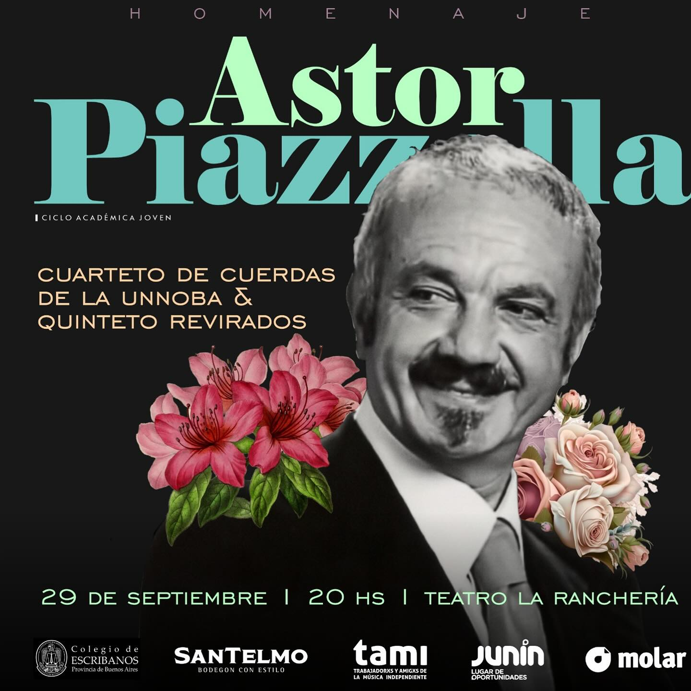

# Ciclo Académica Joven

[Link a la publicación en Instagram](https://www.instagram.com/p/C_tpaPMO2dq/?utm_source=ig_web_copy_link&igsh=ZDNlZDc0MzIxNw==)

Este proyecto se generó usando HTML con bootstrap y algo de CSS  para disponibilizar el programa de concierto homenaje al emblemático Astor Piazzolla en la ciudad de Junín, Bs. As. Argetina el día 29 de Septiembre 2024.

## Programa de concierto

### PRIMERA PARTE

* Tango Ballet
* Tanti Anni Prima
* Lo que vendrá
* Oblivion
* Yo soy María
* Escualo
* Fuga y misterio

#### Cuarteto Unnoba:

* Federico Moujan (violín)
* Pablo Labanda (violín)
* Ricardo Bugallo (viola)
* Verónica Almerares (chelo)

### SEGUNDA PARTE

* Buenos Aires hora cero
* Revirado
* Invierno porteño
* Milonga del ángel
* La muerte del ángel
* Milonga del trovador
* Reminiscencia
* Balada para un loco*
* Adiós Nonino

#### Quinteto Revirados:

* Mariano Guevara (bandoneón)
* Gisela Petraglia (violín)
* Ignacio Iriart (guitarra eléctrica)
* Sofía Piazza (contrabajo)
* Karina Mosquera Oliva (piano)

> **Cantante invitado: Juan Andrés Pastorino**

